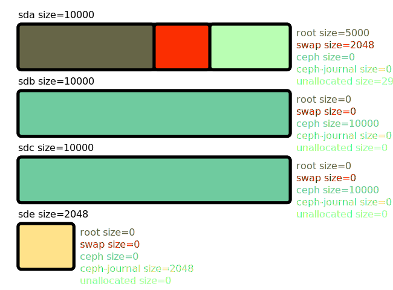
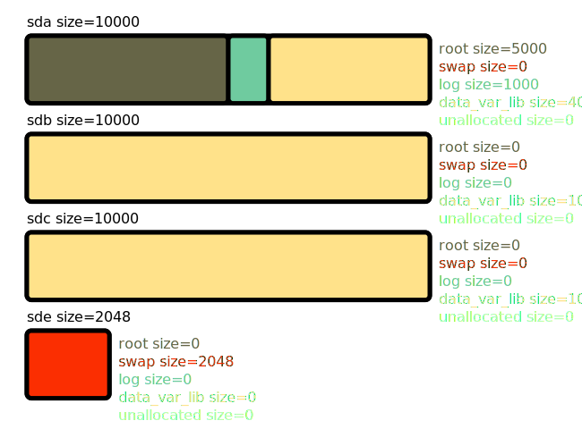
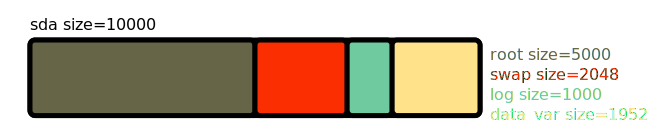

===================
Allocation Examples
===================

    

ceph_ds_multiple_disk
-----------------

Hardware information
~~~~~~~~~~~~~~~~~~~~

.. literalinclude:: schemas/multiple_disk.yaml
    :language: yaml

Dynamic schema
~~~~~~~~~~~~~~
.. literalinclude:: schemas/ceph_ds.yaml
    :language: yaml

Allocation result
~~~~~~~~~~~~~~~~~

        

ceph_ds_single_disk
-----------------

Hardware information
~~~~~~~~~~~~~~~~~~~~

.. literalinclude:: schemas/single_disk.yaml
    :language: yaml

Dynamic schema
~~~~~~~~~~~~~~
.. literalinclude:: schemas/ceph_ds.yaml
    :language: yaml

Allocation result
~~~~~~~~~~~~~~~~~

.. image:: schemas/ceph_ds_single_disk.svg
        :width: 100%

        

simple_os_ds_multiple_disk
-----------------

Hardware information
~~~~~~~~~~~~~~~~~~~~

.. literalinclude:: schemas/multiple_disk.yaml
    :language: yaml

Dynamic schema
~~~~~~~~~~~~~~
.. literalinclude:: schemas/simple_os_ds.yaml
    :language: yaml

Allocation result
~~~~~~~~~~~~~~~~~

        

simple_os_ds_single_disk
-----------------

Hardware information
~~~~~~~~~~~~~~~~~~~~

.. literalinclude:: schemas/single_disk.yaml
    :language: yaml

Dynamic schema
~~~~~~~~~~~~~~
.. literalinclude:: schemas/simple_os_ds.yaml
    :language: yaml

Allocation result
~~~~~~~~~~~~~~~~~

        